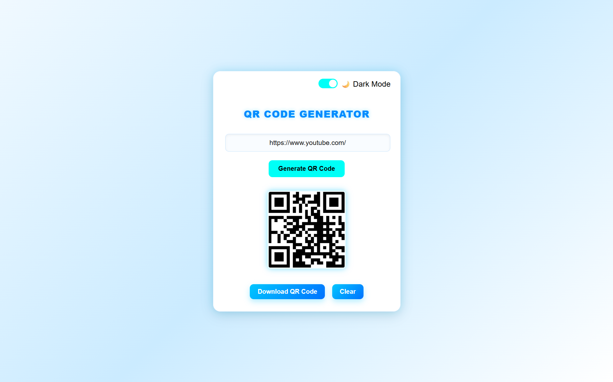
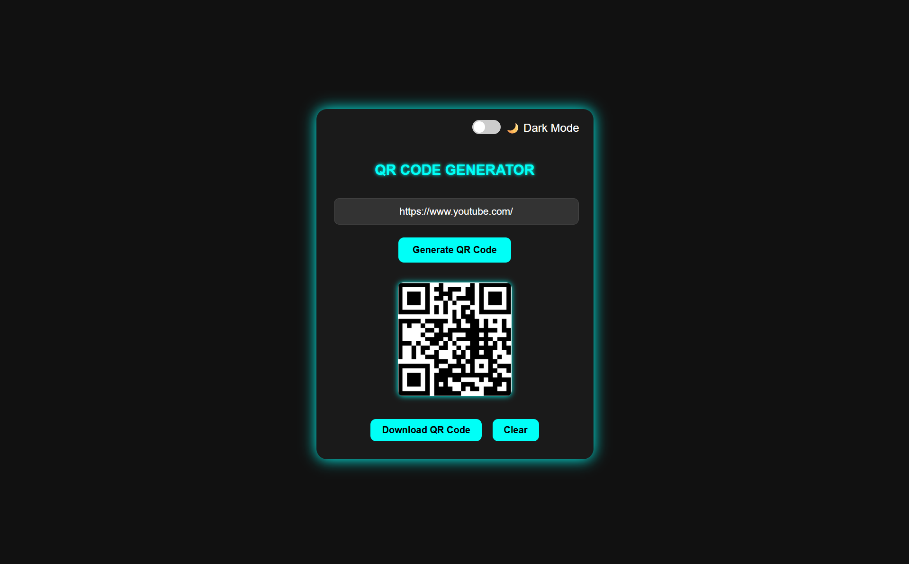
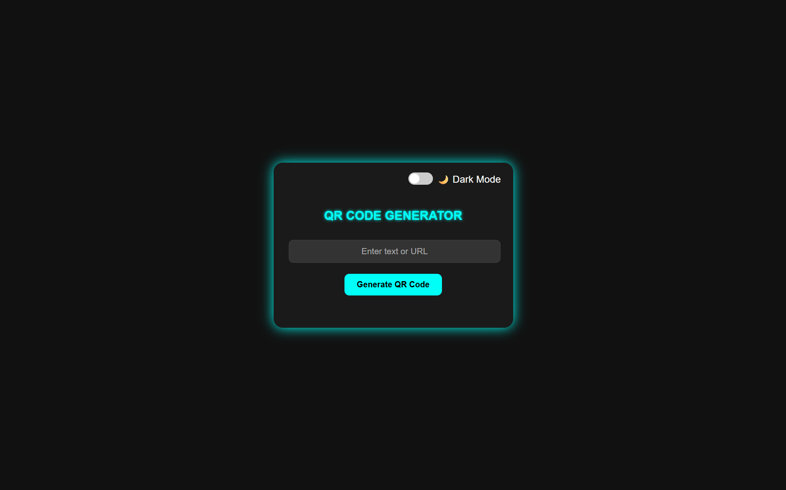

# 🔳 QR Code Generator

A sleek and modern QR Code Generator built using HTML, CSS, and JavaScript.

## 🌟 Features

✅ Enter any **text or URL** to generate a QR code  
✅ **Download** the generated QR code as an image  
✅ **Clear** text and QR code in one click  
✅ **Dark / Light Mode** toggle for user preference  

---

## 🚀 How to Use

1. Type your **text or URL** into the input field.
2. Click **"Generate QR Code"**.
3. The QR Code will be generated.
4. To save the QR Code, click **"Download" button**.
5. Use the **"Clear"** button to reset.
6. Use the **Dark Mode toggle** to switch between light/dark themes.

---

### 🪄 Light Mode  
  

### 🌙 Dark Mode  
  

### 🏠 Homepage Preview  
 

---

## 🛠️ Technologies Used

- HTML5
- CSS3 (with glowing neon effects)
- JavaScript (Vanilla)

---

## 📁 Project Structure

qr-code-generator/
│
├── index.html
├── assets/
| ├── homepage-preview.png
| ├── preview-dark.png
| ├── preview-light.png
├── style.css
├── script.js
└── README.md
